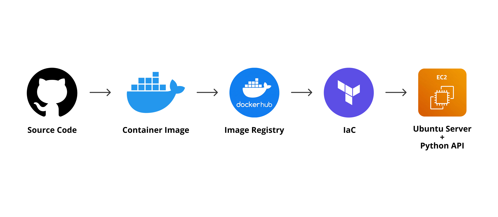
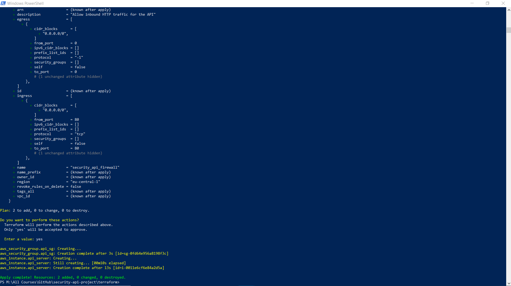
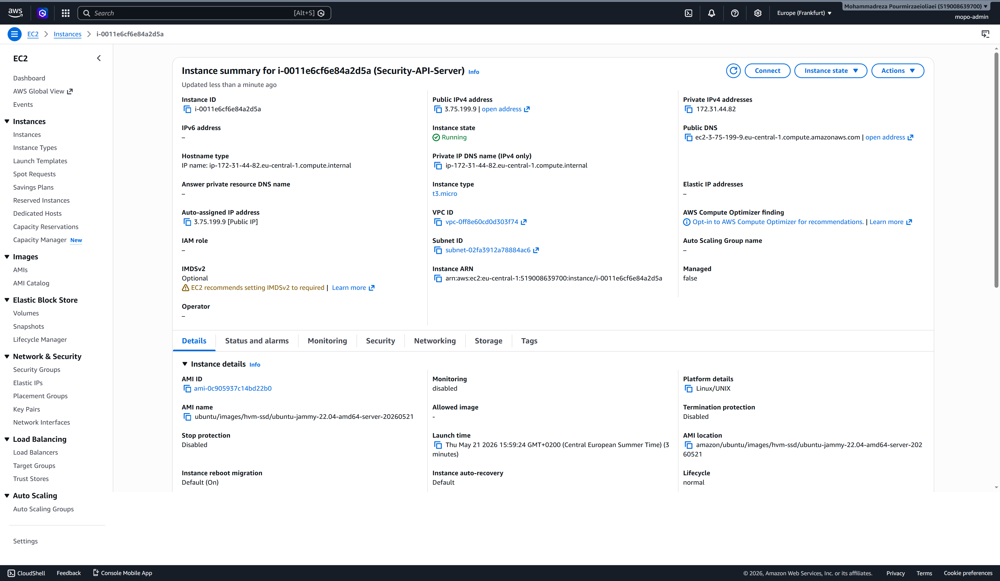
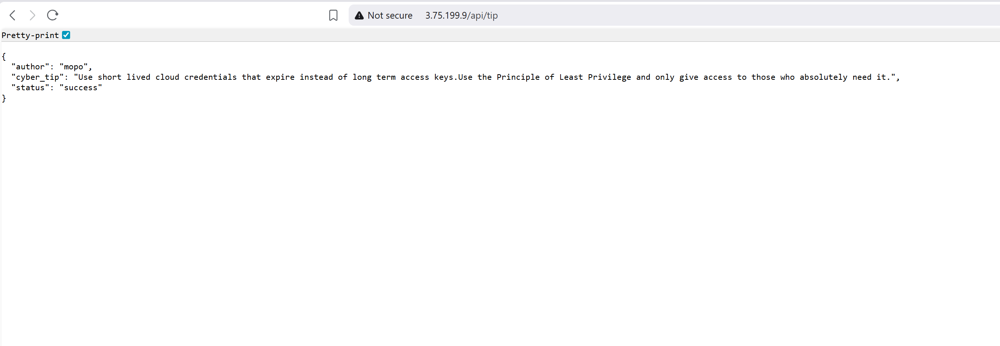

# Containerized Security API on AWS

## The Objective

This project is my step into Infrastructure as Code and Containerization. Instead of just hosting a static website, I built a Python backend API that generates randomized cybersecurity tips. I packaged the application into a Docker container, pushed it to Docker Hub, and wrote Terraform code to automatically deploy it to an AWS EC2 instance. 

## Architecture Flow

1. **Application:** The backend consists of a lightweight Python Flask API that serves randomized cybersecurity best practices in JSON format.
2. **Containerization:** I packaged the app using Docker and intentionally used the `python:3.9-slim` base image to reduce the security attack surface, then pushed the final image to Docker Hub.
3. **Infrastructure as Code (IaC):** Terraform configurations were written to dynamically provision the AWS infrastructure, specifically an EC2 server (t3.micro) in the eu-central-1 region.
4. **Automated Bootstrapping:** A Terraform `user_data` script installs Docker on the server, pulls the image from Docker Hub, and maps standard web traffic (Port 80) to the container's internal API port (8080).
5. **Network Security:** An AWS Security Group, managed via Terraform, acts as a strict firewall to control inbound HTTP traffic while blocking everything else.

## Tech Stack
* **Cloud Provider:** Amazon Web Services (AWS)
* **Infrastructure as Code:** Terraform
* **Containerization:** Docker, Docker Hub
* **Backend:** Python, Flask
* **Version Control:** Git, GitHub

## Deployment Workflow
Rather than manually clicking through the AWS console, this project was deployed using a strict Infrastructure as Code workflow to ensure the environment is reproducible and immune to human error. Before moving to the cloud, the container was built and tested locally using `docker build` and `docker run` to verify the JSON output and port mapping. The actual cloud deployment is executed via the Terraform command line. Running `terraform init` prepares the AWS provider, and `terraform apply` creates the server, configures the firewall, and executes the boot script in under two minutes. Finally, to adhere to best practices for cloud cost optimization, running `terraform destroy` completely deletes all AWS resources when testing is finished to prevent unexpected charges.

## Evidence of Execution

**1. Terraform Infrastructure Provisioning**

**2. AWS EC2 Server Running**

**3. Live API JSON Output**
